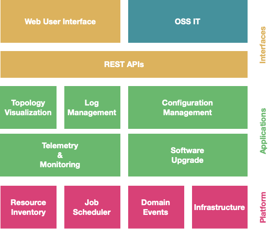

# Leitstand in a Nutshell

Leitstand aims to create a disaggregated management system for disaggregated access networks 
by means of providing the foundation to model the resources forming the network and 
an environment to implement network management _applications_ supplying network management functions.
The scope of an application ranges from small applications that address a single management aspect for a certain element role to generic applications that can be used for all element roles of an access network.

 

Leitstand relies on _service-oriented architecture_ , 
loose coupling through [REST APIs](./doc/REST.md) and 
service encapsulation in docker containers.
Leitstand is also influenced by Eric Evans Domain-Driven Design, 
in the sense of putting the focus on the network management domain and 
leveraging open-source software for general management aspects like log management, telemetry streaming, or time series visualization. 

Integration of third-party components is provided by Leitstand applications.
For example, a log management application connects Leitstand with a specialized log management system.
The integration of the third-party component is typically encapsulated in a dedicated _connector_ service. 
The connector implements a REST-API defined by the Leitstand application and translates Leitstand REST-API calls to API calls of the component to be integrated.
In addition, the connector implements resiliency patterns to guarantee a robust integration of the third-party component and to minimize the blast radius if the third-party component is temporarily unavailable.
Last but not least, the segregation of business logic and integration allows to reuse the business logic when integrating an alternative third-party component supplier. 
Say the business logic of the log management component creates a query to search for all log events of a particular element or group of elements and the connector merely translates this query to a query of the underlying log management system, then just one more connector is needed to support an additional log management system.
This segreggation also simplifies the support of different versions of the same log management system.

The [Leitstand Web User Interface](../leitstand-ui/leitstand-ui-web/README.md) enables a user to work with the REST APIs provided by the Leitstand application and platform services.
Each application can contribute new views to the Leistand UI.

## Repositories

### Leitstand Platform

- The [leitstand-inventory](../leitstand-inventory/README.md) repository contains the Leitstand Resource Inventory to store all elements of a disaggregated access network.
- The [leitstand-job](../leitstand-job/README.md) repository contains the Leitstand Job Scheduler to execute management jobs. 
- The [leitstand-events](../leitstand-events/README.md) repository contains transactual domain event support to subscribe for resource inventory or job state changes.
- The [leitstand-security](../leitstand-security/README.md) repository contains a built-in user repository, access key support for inter-system authentication, encryption utilities, and OAuth 2.0 support.
- The [leitstand-ui](../leitstand-ui/README.md) repository contains the Leitstand UI framework and cross-cutting UI functions (e.g. login/logout).
- The [leitstand-commons](../leitstand-commons/README.md) repository contains Leitstand module foundation classes.

### Leitstand Connectors

- The [leitstand-powerdns](../leitstand-powerdns/README.md) connector forwards DNS record changes to PowerDNS. PowerDNS can either be used as DNS server or as gateway to manage DNS records in the actual DNS server.

### Leitstand Applications

The following Leitstand Applications are in the pipeline for being open-sourced:

- __Log Application__, the log application connects Leitstand with elasticsearch and provides context-sensitive log event list views by means of generating log event queries from inventory records. This simplifies the search for log messages for a certain element or group of elements.
- __Telemetry Application__, the telemetry application allows to configure metrics that can be sampled from the elements including their visualization and monitoring rules. It also includes Leitstand Connectors for Prometheus and Grafana.
- __Topology Application__, the topology application visualizes the link-state graph of the  disaggregated  network.

