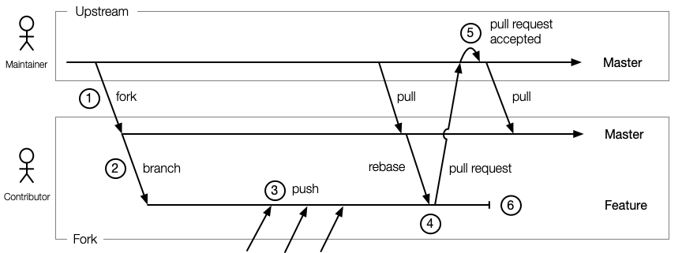

# Leitstand Github Contribution Flow

This document outlines how to contribute to a Leitstand github repository.
The process is similar to the contribution flow elaborated by the [Kuberenetes Community](https://github.com/kubernetes/community/blob/master/contributors/guide/github-workflow.md "Open K8 Community GitHub Flow").

## Overview

The diagram below illustrates the typical set of branches involved when working on a contribution and how the contribution flows into the upstream repository.

 

1. The very first step is to create a fork of the Leitstand github repository.
2. Next it is encouraged to create a feature branch in your fork.
3. All changes are committed and pushed into the feature branch.
4. Once all work is done create a squashed pull request from your feature branch.
   This might require to rebase the feature branch if the upstream repository has
   been updated since the feature work was done.
5. A Leitstand maintainer reviews the pull request and will accept it in order to add the contribution to the upstream master repository.
6. The feature branch can be deleted if the pull request was accepted.

## Working with git/hub CLI
An overview of handy CLI commands is provided by [dta4](https://github.com/dta4/commons/wiki/GitHub-Workflow "DT A4 Gitflow CLI commands").

