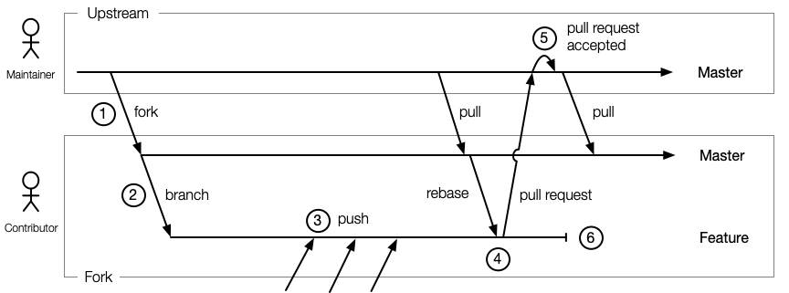

# Leitstand Github Contribution Flow

This document outlines how to contribute to a Leitstand github repository.
The process is similar to the contribution flow elaborated by the [Kuberenetes Community](https://github.com/kubernetes/community/blob/master/contributors/guide/github-workflow.md "Open K8 Community GitHub Flow").

## Overview

The diagram below illustrates the typical set of branches involved when working on a contribution and how the contribution flows into the upstream repository.

 

1. The very first step is to create a fork of the Leitstand github repository.
2. Next it is encouraged to create a feature branch in your fork.
3. All changes are committed and pushed into the feature branch.
4. Once all work is done create a squashed pull request from your feature branch.
   This might require to rebase the feature branch if the upstream repository has
   been updated since the feature fork was created.
5. A Leitstand maintainer reviews the pull request and will accept it in order to add the contribution to the upstream master repository.
6. The feature branch can be deleted if the pull request was accepted.

Looking at the illustration changes flow in a single direction only, namely 
- from upstream master branch to the fork master branch, 
- from the fork master branch to the fork feature branch and eventually
- from the fork feature branch through a pull request to the upstream repository.

By that all changes occurred in the upstream repository while working on a feature can simply be pulled into the master branch of the fork without creating a conflict.  
It is also feasible to work on different features in parallel by creating multiple feature branches.
This is also handy for bug fixing.

__IMPORTANT:__ _All changes to the upstream master repository are applied through squashed pull requests._

The Leitstand community imposed itself the rule, that maintainers are also not allowed to push changes to the upstream repository without creating a pull request.

## Working with git/hub CLI
An overview of handy CLI commands is provided by [dta4](https://github.com/dta4/commons/wiki/GitHub-Workflow "DT A4 Gitflow CLI commands").

